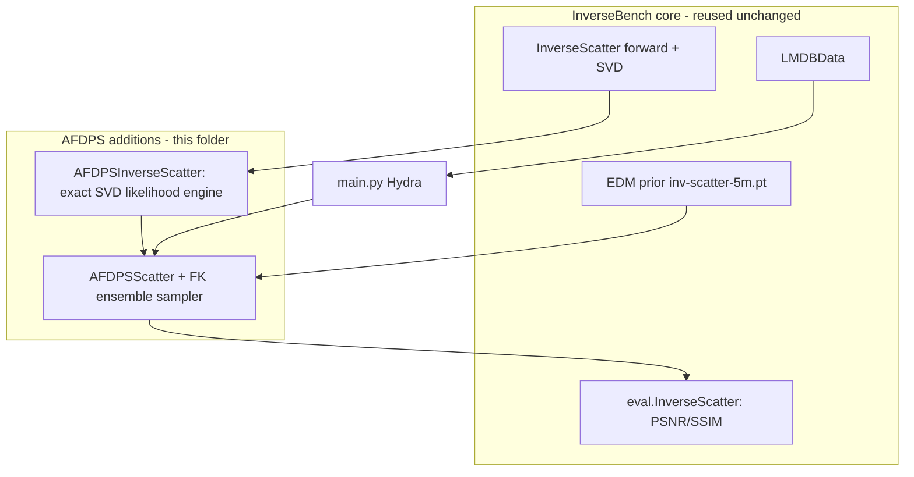

# AFDPS for the Linear Inverse Scattering Problem (InverseBench)

Applies **AFDPS** — *Approximation-Free Diffusion Posterior Sampling* (Chen, Ren, Min, Ying, Izzo, TMLR 2026) — to the **linear inverse scattering** problem from [InverseBench](https://openreview.net/pdf?id=U3PBITXNG6) (ICLR 2025): recover the permittivity contrast `z` from the complex scattered light field `y_sc = H(u_tot ⊙ z) + n`, `u_tot = G(u_in ⊙ z)` (first Born approximation, so the forward map is **linear**). Results are reported in the format of InverseBench **Table 3** (PSNR / SSIM / Meas-err at 360 / 180 / 60 receivers, noise `σ_y = 1e-4`) so AFDPS sits directly next to the benchmark baselines.

All new code lives under `inverse_scattering/`. The InverseBench harness, forward operator, dataset loader, EDM prior, and evaluator are **reused by import from the sibling `navier_stokes/` tree, untouched**, so observation generation and metrics are byte-for-byte the benchmark's and the comparison is fair.

> Inverse scattering is **not** Navier–Stokes. NS has a *nonlinear* PDE forward (needing an adjoint solve + Hutchinson Laplacian). Here the forward is *linear* and the base operator caches a real SVD `A = U Σ Vᵀ`, so the whole AFDPS likelihood engine — gradient, log-likelihood Laplacian, ΠGDM guidance, and an *exact* guidance integrator — is **closed-form and exact**.

## How the pipeline works



- **Operator** [inverse_problems/inverse_scatter_afdps.py](inverse_problems/inverse_scatter_afdps.py): subclasses `InverseScatter`, adds the sampler API on the cached SVD. Folds the affine normalization into the observation once (`ỹ = y/scale − shift·A·1`, `σ̃ = σ_y/(√2·scale)` — the `√2` is the complex `CN(0,σ²)` convention). Never overrides `forward`/`__call__`/`loss`/`normalize` (fairness).
- **Sampler** [algo/afdps_core_scatter/ensemble_denoiser_edm.py](algo/afdps_core_scatter/ensemble_denoiser_edm.py): subclasses the verified NS Feynman–Kac sampler; adds `guidance_step=exact_linear` (integrates the linear guidance ODE exactly in the V-basis — unconditionally stable, DDNM-like data projection at the final step) and fp64 weights.
- **Algorithm** [algo/afdps_scatter.py](algo/afdps_scatter.py): `Algo.inference` wrapper; default `reduce='mean'` (Table 3 is a posterior-mean leaderboard).
- **Harness** [main.py](main.py): the InverseBench loop with a `sys.path` bootstrap + CWD pin so the two trees merge.

## Install

```bash
cd inverse_scattering
python -m venv --system-site-packages .venv && source .venv/bin/activate
pip install torch numpy scipy pyyaml tqdm omegaconf hydra-core lmdb piq requests
# Inference needs no wandb/account.
```

## CPU verification (no GPU, no checkpoint, no data)

The whole value of the SVD engine is that it is *correct*. The ladder runs in seconds:

```bash
.venv/bin/python -m pytest tests/ -q        # 24 checks
```

It verifies: the `√2` complex-noise convention; `A` matches the benchmark `forward`; the affine fold (zero residual at the truth); **the analytic gradient vs autograd through the untouched benchmark `loss`**; the exact Laplacian `Σσᵢ²/σ̃²`; the exact `λ̄`; closed-form ΠGDM vs a dense solve; the **exact-linear substep vs a 20k-step Euler integration**; sampler determinism; the fairness guards (no operator overrides); Hydra composition + searchpath; and — the acceptance gate — a **linear-Gaussian twin** where the AFDPS weighted mean must recover the closed-form posterior mean on the measured subspace.

## Run order (GB200) — always from `inverse_scattering/`

```bash
# 1) assets: prior -> checkpoints/inv-scatter-5m.pt ; data -> ../data/inv-scatter-{test,val}
bash scripts/download_assets.sh

# 2) build the SVD caches for all receiver counts ONCE (avoids a parallel-shard race)
python scripts/precompute_svd.py --numTrans 20 --numRec 360 180 60

# 3) smoke: assert the checkpoint's EDM interface, run 1 case, benchmark per-step throughput
bash scripts/smoke_gb200.sh

# 4) validation sweep per receiver count (10 val cases) -> ranked configs
bash scripts/run_val_sweep.sh 360 512

# 5) full test set (100 cases), sharded on the GPU, with GPU-util logging + aggregation
bash scripts/run_test_all.sh 2 1024 200       # NSHARD J STEPS

# (or one receiver count, then aggregate manually)
bash scripts/run_test.sh 360 2 1024 200
python scripts/aggregate_table3.py --numRec 360 \
    "exps/inference/inverse-scatter-afdps/AFDPS/final_R360_shard*/result_*.pt"
```

A single inference run, for reference:

```bash
python main.py problem=inv-scatter-afdps algorithm=afdps pretrain=inv-scatter \
    num_samples=1 wandb=false problem.model.numRec=360
```

## Finding the best AFDPS configuration

The **primary** config ([configs/algorithm/afdps.yaml](configs/algorithm/afdps.yaml)) is exact anisotropic **ΠGDM** guidance + `exact_linear` integration + weighted **ensemble-mean** output — chosen because (a) `σ_y=1e-4` is near-noiseless so the problem is conditioning-dominated (hard data-consistency on measured modes + prior on the null space, DDNM-style), and (b) Table 3 ranks point estimates, where a posterior *sample* loses PSNR to the mean. The validation sweep ([scripts/run_val_sweep.sh](scripts/run_val_sweep.sh)) does a coordinate descent over the guidance family (`full` / `auto` / `fixed`-γ), `guidance_step` (`exact_linear` vs faithful `euler`), steps, particles, reduction, and resampling, ranking by PSNR on the 10 val cases ([scripts/val_table.py](scripts/val_table.py)). Use the winner per receiver count for the test run.

Override anything on the CLI, e.g. the paper-faithful AFDPS-SDE ablation:

```bash
... algorithm.method.sampler_kwargs.guidance_mode=fixed \
    algorithm.method.sampler_kwargs.guidance_step=euler \
    algorithm.method.guidance_gamma=10 algorithm.method.reduce=best
```

## GB200 efficiency

The AFDPS ensemble is **batched across particles** (one UNet forward over `J` particles per step), so raise `algorithm.method.num_particles` to fill the device — [scripts/smoke_gb200.sh](scripts/smoke_gb200.sh) benchmarks `J ∈ {512,1024,2048}` (ms/step + peak memory) to pick the largest that fits. Cases are **seeded per global id** before observation generation, so the 100-case test set can be **sharded across co-tenant processes** ([scripts/run_test.sh](scripts/run_test.sh), `NSHARD`) with the aggregated mean PSNR independent of shard count. [scripts/gpu_log.sh](scripts/gpu_log.sh) samples `nvidia-smi` and reports mean/median/p10 utilization so you can confirm the device stays near 100%. **Benchmark single-shard utilization first**; only raise `NSHARD` if a real gap remains (each shard reloads the multi-GB SVD factors and contends for SMs). Note: per-case seeding reproduces *inputs*, not bitwise outputs (CUDA GEMM/conv nondeterminism) unless `torch.use_deterministic_algorithms(True)`.

## Comparison target (InverseBench Table 3, `σ_y=1e-4`)

Best PnP-diffusion baselines @ 360 receivers: **RED-diff 36.56**, **DDNM 36.38** PSNR; **DiffPIR/PnP-DM 0.988** SSIM. The aggregator prints the full 12-method baseline table for the chosen receiver count with the AFDPS row appended (markdown + LaTeX) and flags whether AFDPS leads. **Verify the hardcoded baseline values and the Meas-err (%) definition against the PDF before publishing.**

## Open items before the run

- Confirm a separate `inv-scatter-val` LMDB is downloadable (configs ship only `inv-scatter-test`); else split the test set for tuning.
- Confirm the GitHub release checkpoint name (`inv-scatter-5m.pt` vs `in-scatter-5m.pt`; the downloader tries both) and that the CaltechDATA share token is still valid.
- Confirm `numTrans=20` matches the InverseBench Table-3 setup.
- Pin the Meas-err (%) definition to the InverseBench appendix.

See [plan.md](plan.md) for the full design, derivations, and risk analysis.
